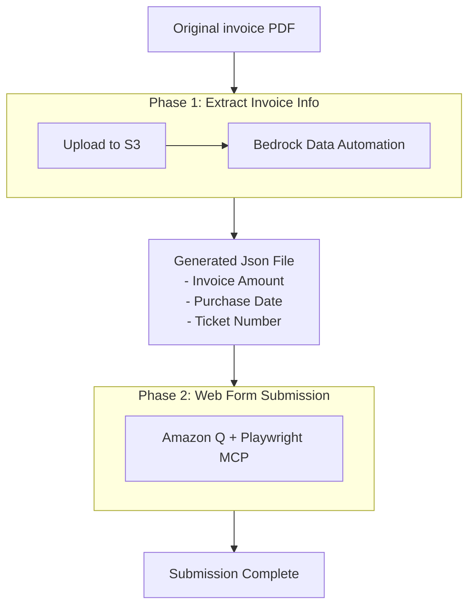

# Amazon Bedrock Data Automation - Invoice Processing

An end-to-end automation solution for processing invoice documents using Amazon Bedrock Data Automation and Playwright MCP for automated form submission.

Demo


## 1. Problem Statement

Manual invoice processing is time-consuming and error-prone. Organizations need to:
- Extract structured data from PDF invoices
- Submit expense claims through web forms
- Track submission status
- Handle batch processing efficiently

## 2. Solution Overview

This solution automates the entire invoice processing workflow using:
- **Amazon Bedrock Data Automation** for AI-powered data extraction
- **Playwright MCP** for automated web form submission
- **Batch processing** for handling multiple invoices

## 3. Architecture



### 3.1 Workflow:
1. **Phase 1 - Extract Invoice Info**: Python App uploads PDFs to S3 and uses Bedrock Data Automation to extract structured data
- 1.1 input: original invoice pdf files
- 1.2 output: a json file that contains extracted invoice amount, purchase date, and ticket number for each processed PDF
2. **Phase 2 - Web Form Submission**: MCP Client uses Amazon Q + Playwright MCP to automatically submit forms and upload attachments
- 2.1 input: the generated json file from phase 1

## 4. Prerequisites

### 4.1 System Requirements
- Python 3.8+
- [uv](https://docs.astral.sh/uv/) package manager
- VS Code with Amazon Q Developer extension (or any LLM with MCP client)
- Chrome/Edge browser with Playwright extension

### 4.2 AWS Requirements
- AWS Account with Bedrock Data Automation access
- AWS CLI configured with appropriate credentials
- Amazon S3 bucket for storing input and output files

## 5. Deployment Instruction

### 5.1. Create Blueprint in Bedrock Data Automation
1. Navigate to Amazon Bedrock Data Automation console
2. Create a new blueprint for invoice processing
3. Configure data extraction fields:
   - `purchase_date`: Date field for transaction date
   - `invoice_amount`: Number field for amount
   - `ticket_number`: Text field for receipt/ticket number


### 5.2. Clone and Setup Project
```bash
git clone <repository-url>
cd invoice-submission
uv sync
```

### 5.3. Configure Environment Variables
```bash
cp .env.example .env
# Edit .env with your AWS credentials:
# AWS_REGION=us-east-1
# BUCKET_NAME=your-s3-bucket-name
# PROJECT_ID=your-bedrock-project-id
```

### 5.4. Configure Playwright MCP (In this case, VS code with Amazon Q Extension)
Create `.amazonq/agents/default.json` in your project root:
```json
{
  "mcpServers": {
    "playwright": {
      "command": "npx",
      "args": [
        "@playwright/mcp@latest",
        "--extension"
      ],
      "disabled": false
    }
  }
}
```

### 5.5. Install Playwright Browser Extension
- Install Playwright extension in Chrome/Edge from browser store
- **Extension Mode**: Uses system default browser with existing SSO credentials
- **Why Extension Mode**: Corporate SSO/authentication already configured in your browser
- This avoids need to re-authenticate or configure corporate access on native Playwright chrome instance


## 6. Step by Step Invoice Processing

### Phase 1: Extract Invoice Info

1. **Prepare Invoice Batch**
```bash
mkdir -p input/batch1
# Copy your PDF invoices to input/batch1/
```

2. **Run Python App**
```bash
uv run python app.py batch1
```

The python app generates a result_{timestamp}.json file in your batch folder, containing the extracted information from all processed PDF files.

**Extracted Fields:**
- `filename`: Original PDF file name (must match actual PDF in folder)
- `purchase_date`: Extracted transaction date (YYYY-MM-DD format)
- `invoice_amount`: Extracted amount in NOK (numeric value)
- `ticket_number`: Extracted receipt/ticket number (string)
- `submitted`: Tracks submission status (false → true after MCP submission)

Example 
```json
[
  {
    "filename": "invoice1.pdf",
    "purchase_date": "2025-08-26",
    "invoice_amount": 72,
    "ticket_number": "4144262946",
    "submitted": false
  },
  {
    "filename": "invoice2.pdf",
    "purchase_date": "2025-09-02",
    "invoice_amount": 68.4,
    "ticket_number": "4145491422",
    "submitted": true
  }
]
```

### Phase 2: Web Form Submission

3. **Prerequisites for MCP Client**
- Ensure VS Code has Amazon Q Developer extension installed
- Verify `.amazonq/agents/default.json` is configured (from Step 5.4)
- Install Playwright browser extension in Chrome/Edge
- **Important**: Extension mode uses your system browser's existing SSO session
- No need to login again - leverages corporate authentication already in browser

4. **Prepare Files for Submission**
- Ensure both PDF files and `result_*.json` are in the same `input/batch1/` folder
- Verify JSON contains extracted data with `"submitted": false` status
- Check that all PDF filenames in JSON match actual files

5. **Use MCP Client (Amazon Q + Playwright MCP)**

Open Amazon Q chat in VS Code and use this prompt:

```
You are helping to submit invoice for reimbursement. You should use Playwright MCP tool to perform the task inside a browser.

There are multiple records in input/batch1/result_X.json file, each item is an invoice.

First, go to https://[YOUR_EXPENSE_PORTAL]

For each invoice, perform the following steps. If there is any error or you are missing any information, stop and ask for help. Do not make things up.
1. Identify first unsubmitted item in the invoice list (where "submitted": false)
2. Make a claim
3. Claim type is "Public Transportation"
4. Receipt date is purchase_date from the json data (yyyy-mm-dd format)
5. Amount is the invoice_amount from the json data
6. Receipt number is ticket_number from the json data
7. Receipt amount is the invoice_amount (NOK)
8. Upload the corresponding PDF file as attachment (filename matches the "filename" field in JSON)
9. Click Next button, wait until it says "Your claim has been sent for approval", then click finish
10. Update the json file, change the submitted value from false to true for this specific invoice and save the json
11. Repeat for next unsubmitted invoice
```

6. **Monitor MCP Client Process**
The MCP Client (Amazon Q + Playwright MCP) will automatically:
- **Navigate** to the expense portal
- **Login** using existing browser credentials
- **Read JSON data** and identify unsubmitted invoices
- **Fill forms** with extracted invoice data:
  - Claim type: Public Transportation
  - Receipt date: From `purchase_date`
  - Amount: From `invoice_amount`
  - Receipt number: From `ticket_number`
- **Upload attachments** using PDF filenames from JSON
- **Submit claims** and wait for confirmation
- **Update JSON** status to `"submitted": true`
- **Process next invoice** until all are submitted

7. **Verify Completion**
- Check that all invoices in JSON now show `"submitted": true`
- Verify submissions in the expense portal
- Review any error messages from Amazon Q for failed submissions


## 7. Project Structure

```
invoice_submission/
├── app.py                    # Main application
├── src/                      # Source code modules
│   ├── bda_client.py        # BDA operations
│   └── result_processor.py  # Result processing & JSON generation
├── input/                    # Local input folders (gitignored)
│   └── batch1/              # Example batch folder
│       ├── invoice1.pdf     # PDF files to process
│       ├── invoice2.pdf
│       └── result_*.json    # Generated results
└── pyproject.toml           # Project configuration
```


## 8. Troubleshooting

### Data Extraction Issues
- Set `DEBUG = True` in `src/bda_client.py` for detailed AWS logs
- Verify AWS credentials and S3 bucket permissions
- Check PDF quality and format compatibility

### MCP Client Issues
- Ensure browser extension is installed
- Verify Amazon Q Developer extension is active
- Check MCP configuration in `.amazonq/agents/default.json`

### Common Commands

```bash
# Process new batch
uv run python app.py batch2

# Check project structure
tree -I '__pycache__|.git|.venv'

# Add dependencies
uv add package-name
```

## License

This project is licensed under the MIT License - see the [LICENSE](LICENSE) file for details. 